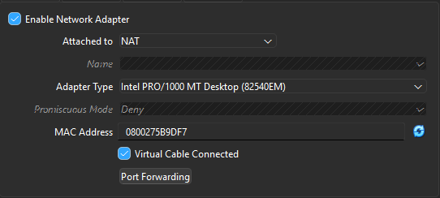

# Windows Server 2022 Setup Guide

## Overview

This guide provides step-by-step instructions to set up **Windows Server 2022** for an Active Directory home lab. It is intended for learning and practicing enterprise IT tasks in a safe, virtual environment.

---

## Step 1: Installation

   1. Open your virtualization software.
   2. Created a new VM with the following specs:
   6GBs of Ram
   2 CPU cores
   40GB Virtual Hard Drive Space (Installed on NVME for faster performance)
   3. Mounted the Windows Server ISO
   4. Selected Datacenter Evaluation (Desktop Experience) **Chosen for the GUI**

---
## 🌐 Network Setup

*Figure 1: NAT adapter configuration.*  
The **NAT adapter** is used to provide the virtual machine with internet connectivity through the host machine (your home router). This allows the server to access updates, download tools, and communicate with external networks.

*Figure 2: Internal adapter configuration.*  
The **Internal adapter** is used for the lab network, allowing the virtual machine to communicate with other lab VMs (like domain-joined clients) without exposing them directly to the internet. The domain controller handles internal network connectivity and routing between VMs.

# Domain Setup

Click Add Roles and Features then click Active Directory Domain Services bringing you to the setup wizard

*Figure 3 Server Roles*
Click Add Features then continue on with the promotion 

*Figure 4 Domain Setup Wizard*
Click new forest and then name it whatever you want in my case titaninc (Do not add the .com it will add an extension automatically)
Continue clicking through until Wizard is Done

# Post Setup
These are all Images showing succesful Domain Promotion

Now Showing the Domain Name right before the user

![
